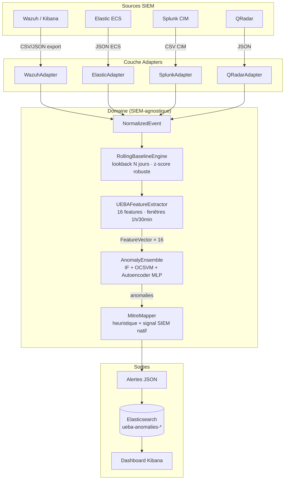

# UEBA Portable — Détection d'anomalies comportementales pour la chasse aux menaces

> **Projet de Fin d'Études** — ENSA Tanger, Génie des Systèmes de Télécommunications et Réseaux (5ème année).
>
> **Titre :** Conception et implémentation d'un système UEBA portable pour la chasse aux menaces,
> basé sur l'apprentissage automatique non supervisé, intégré à un SIEM et mappé au framework MITRE ATT&CK.

[](https://github.com/YOUR_ORG/ueba-portable/actions/workflows/ci.yml)
[](https://www.python.org/)
[](LICENSE)

---

## Table des matières

1. [Vue d'ensemble](#1-vue-densemble)
2. [Architecture](#2-architecture)
3. [Installation](#3-installation)
4. [Quickstart](#4-quickstart)
5. [Mapping des champs SIEM](#5-mapping-des-champs-siem)
6. [Les 16 features comportementales](#6-les-16-features-comportementales)
7. [Réduction des faux positifs — 3 leviers](#7-réduction-des-faux-positifs--3-leviers)
8. [Modes d'apprentissage](#8-modes-dapprentissage)
9. [Validation : détection du Password Spray (T1110.003)](#9-validation--détection-du-password-spray-t1110003)
10. [Mapping MITRE ATT&CK](#10-mapping-mitre-attck)
11. [Ajouter un nouveau SIEM](#11-ajouter-un-nouveau-siem)
12. [Configuration `.env`](#12-configuration-env)
13. [Exploitation SOC : MTTD, risk scoring, dashboards & surveillance continue](#13-exploitation-soc--mttd-risk-scoring-dashboards--surveillance-continue)
14. [Structure du projet](#14-structure-du-projet)
15. [Contribuer](#15-contribuer)
16. [Licence](#16-licence)

---

## 1. Vue d'ensemble

UEBA Portable est un pipeline de détection d'anomalies comportementales sur les journaux de sécurité Windows.
Il est conçu pour être **portable entre SIEMs** : une couche d'adapters découple le format source
(Wazuh, Elastic ECS, Splunk CIM, QRadar) d'un cœur ML non supervisé indépendant de toute source de données.

**Fonctionnalités clés :**

- Fenêtres glissantes par utilisateur (1 h / pas 30 min) — sensibilité sans latence d'alerte excessive
- 16 features comportementales couvrant volume, diversité, privilèges, temporalité et z-scores relatifs à la baseline
- Ensemble de trois détecteurs (IsolationForest + OneClassSVM + Autoencoder MLP) — vote majoritaire ≥ 2/3
- Baseline glissante N-day par utilisateur — z-score robuste (médiane + MAD) pour réduire les faux positifs
- Mapping automatique vers MITRE ATT&CK — heuristique sur les features + signal natif du SIEM
- Détection collective du Password Spraying (T1110.003) — pattern population, pas uniquement individuel
- Filtrage des comptes machine intégré à la couche d'adaptation (avant extraction de features)

---

## 2. Architecture



> Architecture hexagonale : le **domaine** ne dépend d'aucun SIEM.
> Les adapters traduisent les formats sources vers `NormalizedEvent`.
> Voir [`docs/architecture.md`](docs/architecture.md) pour les diagrammes détaillés.

---

## 3. Installation

### Prérequis

- Python ≥ 3.10
- [Poetry](https://python-poetry.org/) ≥ 1.7

### Installation des dépendances

```bash
git clone https://github.com/YOUR_ORG/ueba-portable.git
cd ueba-portable
poetry install
```

### Vérification

```bash
poetry run pytest            # 211 tests, couverture globale 97 %
poetry run ueba version
```

---

## 4. Quickstart

### Analyser un export Wazuh (CSV)

```bash
poetry run ueba run data/raw/export.csv --source wazuh --output anomalies.json
```

### Options du sous-commande `run`

| Option | Défaut | Description |
|---|---|---|
| `--source` | `wazuh` | Format SIEM : `wazuh`, `elastic`, `splunk`, `qradar` |
| `--output` | `anomalies.json` | Fichier de sortie JSON |
| `--window-hours` | `1.0` | Taille de la fenêtre glissante (heures) |
| `--step-minutes` | `30` | Pas de glissement (minutes) |
| `--lookback-days` | `7` | Fenêtre de lookback pour la baseline |
| `--mode` | `per-user` | Stratégie d'apprentissage : `per-user` ou `global` |

### Exemple de sortie JSON

```json
[
  {
    "user": "k.alaa",
    "window_start": "2026-05-16T14:02:10",
    "window_end": "2026-05-16T15:02:10",
    "is_anomaly": true,
    "mode": "per-user",
    "used_model": "k.alaa",
    "vote_count": 3,
    "votes": {"isolation_forest": true, "one_class_svm": true, "autoencoder": true}
  }
]
```

---

## 5. Mapping des champs SIEM

Les adapters traduisent les champs natifs de chaque SIEM vers le schéma `NormalizedEvent`.

| Champ NormalizedEvent | Wazuh (CSV Kibana) | Elastic ECS | Splunk CIM | QRadar |
|---|---|---|---|---|
| `timestamp` | `@timestamp` | `@timestamp` | `_time` | `startTime` |
| `user` | `data.win.eventdata.targetUserName` | `user.name` | `user` | `username` |
| `event_id` | `data.win.system.eventID` | `winlog.event_id` | `EventCode` | `eventId` |
| `host` | `data.win.eventdata.workstationName` | `host.hostname` | `ComputerName` | `deviceAddress` |
| `src_ip` | `data.win.eventdata.ipAddress` | `source.ip` | `src_ip` | `sourceIP` |
| `logon_type` | `data.win.eventdata.logonType` | `winlog.event_data.LogonType` | `LogonType` | `eventProperty` |
| `process_name` | `data.win.eventdata.processName` | `process.name` | `Process_Name` | `commandLine` |
| `rule.mitre.id` | `rule.mitre.id` | `threat.technique.id` | — | — |

**Identifiants d'événements Windows reconnus :**

| Event ID | Signification | Feature impactée |
|---|---|---|
| 4624 | Logon réussi | `login_count` |
| 4625 | Logon échoué | `failed_login_count` |
| 4634 / 4647 | Logoff | — (ignoré) |
| 4672 | Privileges spéciaux | `priv_logon_count` |
| 4688 | Création de processus | `process_count`, `process_entropy` |
| 4769 | Requête ticket Kerberos | `kerberos_count` |

---

## 6. Les 16 features comportementales

Chaque observation est un tuple **(utilisateur, fenêtre 1h)** décrit par 16 features :

### Volume de connexion

| Feature | Description | Signal détecté |
|---|---|---|
| `login_count` | Nombre de connexions réussies | Activité inhabituelle (pic ou creux) |
| `failed_login_count` | Nombre d'échecs de connexion | Brute force, password spray |
| `failed_login_ratio` | Ratio échecs / total tentatives | Attaque ciblée sur un compte |

### Diversité des ressources

| Feature | Description | Signal détecté |
|---|---|---|
| `unique_hosts` | Nombre d'hôtes distincts contactés | Mouvement latéral |
| `unique_logon_types` | Variété des types de logon | Accès hybride inhabituel |
| `process_entropy` | Entropie de Shannon des processus | LoL (Living-off-the-Land), scripts |
| `unique_processes` | Nombre de processus distincts | Toolset offensif |
| `process_count` | Total créations de processus | Activité automatisée |

### Privilèges et Kerberos

| Feature | Description | Signal détecté |
|---|---|---|
| `priv_logon_count` | Connexions avec privilèges spéciaux (4672) | Escalade de privilèges (T1078) |
| `kerberos_count` | Requêtes TGS Kerberos (4769) | Kerberoasting (T1558.003) |

### Temporalité

| Feature | Description | Signal détecté |
|---|---|---|
| `off_hours_ratio` | Fraction d'activité hors heures de bureau | Accès non autorisé, compromission |
| `weekend_ratio` | Fraction d'activité le week-end | Accès hors cycle habituel |
| `login_velocity` | Connexions par minute | Automatisation, credential stuffing |
| `host_velocity` | Nouveaux hôtes par minute | Reconnaissance réseau rapide |

### Baseline individuelle (z-scores robustes)

| Feature | Description | Rôle anti-faux-positif |
|---|---|---|
| `z_login_count` | Z-score robuste de `login_count` vs. baseline N-day | Relativise la volumétrie à l'historique individuel |
| `z_process_count` | Z-score robuste de `process_count` vs. baseline N-day | Relativise l'activité process au comportement habituel |

---

## 7. Réduction des faux positifs — 3 leviers

Le système combine trois mécanismes complémentaires pour réduire le taux de fausse alerte :

### Levier 1 — Vote majoritaire d'ensemble (≥ 2/3)

Trois détecteurs indépendants (IsolationForest, OneClassSVM, Autoencoder MLP) doivent tous
au moins deux d'entre eux déclarer une anomalie pour qu'une alerte soit émise.
Un pic de volume isolé qui n'est anormal que pour un seul modèle est filtré silencieusement.

### Levier 2 — Z-score robuste sur baseline glissante N-day

Les features `z_login_count` et `z_process_count` mesurent l'écart au comportement *individuel*
sur les N jours précédents (médiane + MAD, constante 1.4826). Un administrateur système avec
100 connexions/jour n'est pas anormal *pour lui* : son z-score reste proche de 0.
La baseline est déclarée non fiable (`is_reliable = False`) si elle compte moins de 5 observations,
et les z-scores valent alors 0.0 (comportement prudent sur historique insuffisant).

### Levier 3 — Filtrage des comptes machine à l'adaptation

Les comptes se terminant par `$` (comptes machine Active Directory) et les comptes de service
standards (`SYSTEM`, `LOCAL SERVICE`, `NETWORK SERVICE`) sont éliminés dans la couche adapter,
avant toute extraction de feature. Ces comptes génèrent une activité légitime à très haute fréquence
qui polluerait les baselines et produirait des alertes massives sans valeur opérationnelle.

---

## 8. Modes d'apprentissage

Deux stratégies de modélisation, sélectionnables via `--mode` (CLI) ou
`ensemble_mode` (pipeline). Le défaut est **per-user**.

### Mode global (`AnomalyEnsemble`)

Un **unique** modèle appris sur la population entière. Simple, mais sa
baseline collective est dominée par les comptes les plus actifs : les autres
entités paraissent anormales par défaut (biais de population).

### Mode per-user (`PerUserAnomalyEnsemble`) — recommandé

Un modèle **dédié par utilisateur**, entraîné uniquement sur son propre
historique. C'est la véritable UEBA personnalisée, conforme à la littérature
(Salem & Stolfo 2011 ; Veeramachaneni et al. 2016) : chaque entité est jugée
par rapport à *sa* normalité, pas à celle des autres. Un utilisateur jamais
vu à l'apprentissage déclenche une alerte par défaut (*default-deny*).

#### Workflow SOC recommandé : apprendre le « normal », puis détecter

C'est le mode d'emploi d'un analyste SOC : on apprend la baseline sur une
période **propre** (sans incident connu), on **fige** le modèle, puis on
détecte sur des données nouvelles. Tout écart à la normalité apprise devient
une alerte.

```bash
# 1) APPRENDRE le normal sur une période propre (sans attaque) — sur 100% des données
poetry run ueba train --input baseline_propre.csv --mode per-user \
    --train-ratio 1.0 --save-model models/baseline.joblib

# 2) DÉTECTER sur des données live (nouveau jour, nouvel export)
poetry run ueba detect --input live.csv \
    --load-model models/baseline.joblib --output alertes.json
```

> La commande `train` utilise par défaut `--train-ratio 1.0` : elle apprend
> sur **l'intégralité** du jeu propre fourni. La préparation d'un dataset sans
> incident relève de l'utilisateur (séparation des préoccupations).
>
> Le OneClassSVM est réglé par défaut sur `--svm-nu 0.05` (mode per-user) :
> sur une baseline propre on ne tolère que peu d'outliers, ce qui réduit
> fortement les faux positifs. Abaisse encore cette valeur si ton taux
> d'anomalies sur le normal reste trop élevé.

Pour une évaluation rapide (apprentissage **et** scoring sur le même export,
avec holdout 80/20) :

```bash
poetry run ueba run data/raw/export.csv --mode per-user --output anomalies.json
```

### Résultats comparés (dataset Wazuh réel, 14 jours, T1110.003)

| Métrique                  | Global  | Per-user |
|---------------------------|---------|----------|
| Recall fenêtre            |  29.4%  |  56.7%   |
| Recall opérationnel       |   N/A   | 100.0%   |
| Détection en 1ʳᵉ fenêtre  |   N/A   |  14/14   |
| FP rate (jours propres)   |   2.8%\* |  31.6%   |

> \* En mode global, les faux positifs se concentrent sur `soc-admin` ; ce taux
> masque un biais de population (taux d'anomalies global de 44 %, `k.alaa`
> flaguée à 100 % des fenêtres). Analyse détaillée :
> [`docs/per_user_vs_global.md`](docs/per_user_vs_global.md).

---

## 9. Validation : détection du Password Spray (T1110.003)

La fixture de test `tests/integration/fixtures/sample_logs.csv` inclut un scénario de
**password spraying** synthétique : 7 comptes cibles, 2 à 4 échecs de connexion chacun,
sur une fenêtre de 6 minutes (14h02–14h08 le 16 mai 2026), depuis une IP unique (`10.10.0.50`).

### Résultat attendu

```
T1110.003 — Brute Force: Password Spraying
Tactique : Credential Access
Rationale : 7 comptes distincts (alice.martin, bob.chen, charlie.kim, diana.wolf,
            eric.santos, fiona.lee, george.nasir) présentent des échecs de connexion
            synchronisés sur la fenêtre 2026-05-16 14:00 – 15:05
Source    : heuristic
```

### Pourquoi le password spray échappe au brute force individuel

| Indicateur | Brute Force (T1110) | Password Spray (T1110.003) |
|---|---|---|
| Comptes ciblés | 1 compte, nombreux mots de passe | Nombreux comptes, 1–2 mots de passe chacun |
| `failed_login_count` par compte | Très élevé (déclenche verrouillage) | Modéré (sous le seuil de verrouillage) |
| Détection nécessaire | Individuelle (par compte) | Collective (population de comptes) |
| Seuil `PASSWORD_SPRAY_MIN_USERS` | N/A | ≥ 3 comptes simultanés |

La détection T1110.003 est implémentée dans `MitreMapper.match_population()` et n'est
possible qu'en regroupant les vecteurs de tous les utilisateurs sur la même fenêtre temporelle.

### Lancer les tests d'intégration

```bash
poetry run pytest tests/integration/ -v
```

---

## 10. Mapping MITRE ATT&CK

### Heuristiques individuelles (par utilisateur × fenêtre)

| Technique | Nom | Tactique | Feature déclenchante | Seuil |
|---|---|---|---|---|
| T1110 | Brute Force | Credential Access | `failed_login_count` | > 5 |
| T1078.003 | Valid Accounts: Local Accounts | Privilege Escalation | `priv_logon_count` | > 3 |
| T1558.003 | Kerberoasting | Credential Access | `kerberos_count` | > 5 |
| T1059 | Command and Scripting Interpreter | Execution | `process_entropy` | > 2.0 bits |
| T1021 | Remote Services | Lateral Movement | `host_velocity` | > 0.05 hôtes/min |
| T1078 | Valid Accounts | Defense Evasion | `off_hours_ratio` > 0.5 **ET** `unique_hosts` > 2 | combiné |

### Détection collective (population)

| Technique | Nom | Tactique | Condition | Seuil |
|---|---|---|---|---|
| T1110.003 | Brute Force: Password Spraying | Credential Access | ≥ N comptes avec `failed_login_count` ≥ 2 sur même fenêtre temporelle | N ≥ 3 |

### Signal natif SIEM (prioritaire)

Quand un événement contient le champ `rule.mitre.id` (Wazuh) ou `threat.technique.id` (Elastic),
ce signal est ajouté en tête de liste, avant les heuristiques internes.

---

## 11. Ajouter un nouveau SIEM

1. **Créer l'adapter** dans `src/ueba/adapters/mon_siem.py` :

```python
from ueba.adapters.base import SIEMAdapter, AdapterConfig
from ueba.domain.schema import NormalizedEvent

class MonSiemAdapter(SIEMAdapter):
    SOURCE_NAME = "mon_siem"

    def normalize(self, raw_records: list[dict]) -> list[NormalizedEvent]:
        events = []
        for record in raw_records:
            # 1. Parser le timestamp avec dateutil (D2)
            # 2. Filtrer les comptes machine (D4)
            # 3. Construire NormalizedEvent
            ...
        return events
```

2. **Enregistrer l'adapter** dans `src/ueba/adapters/registry.py` :

```python
from ueba.adapters.mon_siem import MonSiemAdapter
_REGISTRY["mon_siem"] = MonSiemAdapter
```

3. **Ajouter le mapping de champs** dans la section [Mapping SIEM](#5-mapping-des-champs-siem) du README.

4. **Écrire les tests** dans `tests/unit/test_adapter_mon_siem.py` (contrat `SIEMAdapter.normalize()`).

Le cœur ML (`features.py`, `ensemble.py`, `mitre.py`) ne change pas.

---

## 12. Configuration `.env`

Créer un fichier `.env` à la racine (non versionné — voir `.gitignore`) :

```dotenv
# Elasticsearch (optionnel — pour l'indexation des anomalies)
ES_HOST=https://localhost:9200
ES_USERNAME=elastic
ES_PASSWORD=changeme
ES_INDEX_PREFIX=ueba-anomalies

# Pipeline
UEBA_LOOKBACK_DAYS=7
UEBA_WINDOW_HOURS=1
UEBA_STEP_MINUTES=30
UEBA_MIN_OBSERVATIONS=5
```

Les valeurs sont lues par `src/ueba/infrastructure/config.py` via `python-dotenv`.

> **Sécurité :** ne jamais committer de credentials réels. Utiliser un gestionnaire de secrets
> (Vault, AWS Secrets Manager, Variables CI/CD) en production.

---

## 13. Exploitation SOC : MTTD, risk scoring, dashboards & surveillance continue

Au-delà de la détection, le projet fournit la couche **exploitation SOC** attendue
en production : mesure du délai de détection, scoring du risque, tableaux de bord
Kibana et surveillance continue automatisée.

### 13.1 MTTD — Mean Time To Detect

`src/ueba/metrics/mttd.py` (`MTTDCalculator`) mesure le délai entre le début connu
d'une attaque et la première détection émise pour chaque utilisateur ciblé.

```bash
python scripts/calculate_mttd.py     # calcule, affiche, sauvegarde et indexe (ueba-mttd)
```

> Sur la campagne T1110.003 (1ʳᵉ vague, 13 mai 11h00) : **MTTD global = 14.9 min**,
> recall opérationnel **7/7 (100 %)**. Résultat indexé dans l'index `ueba-mttd`.

### 13.2 Risk score & niveaux d'alerte

`src/ueba/scoring/risk.py` (`RiskScorer`) transforme le verdict ML en un **score de
risque 0–100** (consensus ML × intensité), puis en **niveau d'alerte** :

| Niveau | Seuil `risk_score` |
|---|---|
| CRITIQUE | ≥ 80 |
| ÉLEVÉ | ≥ 60 |
| MOYEN | ≥ 40 |
| FAIBLE | < 40 |

```bash
python scripts/enrich_risk_levels.py   # enrichit ueba-anomalies-* (risk_score + risk_level)
```

> Distribution obtenue (7 utilisateurs ciblés) : **126 CRITIQUE, 275 ÉLEVÉ, 94 MOYEN**
> — 6 utilisateurs atteignent le niveau CRITIQUE.

### 13.3 Dashboards Kibana

Dashboards Lens natifs, auto-suffisants (les data views sont inclus dans le `.ndjson`),
générés par script pour être reproductibles :

| Fichier | Dashboard | Contenu |
|---|---|---|
| `docs/kibana/ueba-dashboard-v2.ndjson` | « UEBA — SOC Dashboard » | 7 visualisations (timeline, KPIs, MITRE, top users, heatmap, table) |
| `docs/kibana/ueba-dashboard-v3.ndjson` | « UEBA — SOC Dashboard v3 » | 12 visualisations = v2 **+** KPI MTTD, table MTTD, bar risk score, pie niveaux d'alerte, KPI users CRITIQUE |

```bash
# Génération (optionnel) puis import dans Kibana
python docs/kibana/generate_dashboard_v3.py
curl -s -u "$ES_USERNAME:$ES_PASSWORD" \
  "http://localhost:5601/api/saved_objects/_import?overwrite=true" \
  -H "kbn-xsrf: true" --form file=@docs/kibana/ueba-dashboard-v3.ndjson
```

> Pré-requis données : rejouer `enrich_mitre.sh`, `enrich_risk_levels.py` et
> `calculate_mttd.py` si l'index `ueba-anomalies-*` est recréé, sinon les
> visualisations MITRE / risk / MTTD seront vides. Le champ `risk_level` étant
> mappé dynamiquement en `text`, les agrégations Kibana utilisent `risk_level.keyword`.

### 13.4 Simulation d'attaque & démonstration

| Script | Rôle |
|---|---|
| `scripts/simulate_attack.ps1` | Password spraying T1110.003 en laboratoire (génère des 4625) — **usage pédagogique uniquement** |
| `scripts/export_recent_logs.py` | Exporte `wazuh-alerts-*` (N dernières minutes) au format CSV WazuhAdapter |
| `scripts/demo_soutenance.sh` | Démonstration bout-en-bout : export → `ueba detect --to-es` → URL Kibana |

### 13.5 Surveillance continue (cron / systemd)

`scripts/continuous_detect.sh` enchaîne export → détection → indexation toutes les
30 minutes. Deux modes de déploiement (détaillés dans [`docs/deployment.md`](docs/deployment.md)) :

```bash
# Option A — crontab
*/30 * * * * /bin/bash ~/ueba-portable/scripts/continuous_detect.sh

# Option B — systemd (recommandé)
sudo cp ueba-detect.service ueba-detect.timer /etc/systemd/system/
sudo systemctl enable --now ueba-detect.timer
```

---

## 14. Structure du projet

```
ueba-portable/
├── src/ueba/
│   ├── adapters/          # Traducteurs SIEM → NormalizedEvent
│   │   ├── base.py        # Contrat SIEMAdapter + filtrage comptes machine
│   │   ├── wazuh.py       # Wazuh/Kibana CSV
│   │   ├── elastic.py     # Elastic ECS JSON
│   │   ├── splunk.py      # Splunk CIM CSV
│   │   ├── qradar.py      # QRadar JSON
│   │   └── registry.py    # get_adapter(source_name)
│   ├── domain/            # Cœur métier (SIEM-agnostique)
│   │   ├── schema.py      # NormalizedEvent (Pydantic)
│   │   ├── baseline.py    # UserBaseline, BaselineRepository, z-score robuste
│   │   ├── features.py    # UEBAFeatureExtractor (16 features, fenêtres glissantes)
│   │   ├── ensemble.py    # AnomalyEnsemble (IF + OCSVM + Autoencoder MLP)
│   │   ├── per_user_ensemble.py  # PerUserAnomalyEnsemble (un modèle par utilisateur)
│   │   └── mitre.py       # MitreMapper (heuristiques + signal SIEM + population)
│   ├── scoring/
│   │   ├── rolling_baseline.py  # RollingBaselineEngine (baseline glissante N-day)
│   │   └── risk.py        # RiskScorer + RiskLevel (score 0–100, niveaux d'alerte)
│   ├── metrics/
│   │   └── mttd.py        # MTTDCalculator + MTTDReport (Mean Time To Detect)
│   ├── infrastructure/    # I/O, config YAML/.env, logging, ElasticWriter
│   ├── cli.py             # Entrée CLI `ueba run` / `train` / `detect` / `version`
│   └── pipeline.py        # UEBAPipeline (orchestration extract → fit → predict, global/per-user)
├── tests/
│   ├── unit/              # Tests unitaires (dont test_mttd.py, test_risk_scoring.py)
│   └── integration/
│       ├── fixtures/
│       │   └── sample_logs.csv   # 103 événements synthétiques, 7 utilisateurs
│       ├── test_password_spray_detection.py
│       └── test_pipeline.py      # Pipeline bout-en-bout (global + per-user)
│   # 211 tests au total, couverture globale 97 %
├── notebooks/             # Exploration, analyse des features, visualisation
├── scripts/               # Pipeline + exploitation SOC :
│   ├── calculate_mttd.py        # MTTD depuis ES → index ueba-mttd
│   ├── enrich_risk_levels.py    # risk_score + risk_level sur ueba-anomalies-*
│   ├── export_recent_logs.py    # wazuh-alerts-* → CSV WazuhAdapter
│   ├── simulate_attack.ps1      # Password spraying T1110.003 (labo)
│   ├── demo_soutenance.sh       # Démo bout-en-bout
│   └── continuous_detect.sh     # Surveillance continue (cron/systemd)
├── docs/
│   ├── kibana/            # Dashboards Lens + générateurs + enrich_mitre.sh
│   └── deployment.md      # Déploiement, cron, systemd
├── ueba-detect.service    # Unité systemd (surveillance continue)
├── ueba-detect.timer      # Timer systemd (toutes les 30 min)
├── .github/workflows/     # CI GitHub Actions (Python 3.10/3.11/3.12)
├── pyproject.toml         # Dépendances Poetry + config outils
└── .env.example           # Template de configuration (à copier en .env)
```

---

## 15. Contribuer

```bash
# Installer les dépendances de développement
poetry install --with dev

# Lancer les tests
poetry run pytest

# Linter et formatage
poetry run ruff check src/ tests/
poetry run black src/ tests/

# Type checking
poetry run mypy src/
```

Les pull requests doivent maintenir la couverture de tests > 80 % et passer tous les checks CI.

---

## 16. Licence

Ce projet est distribué sous licence **MIT**. Voir le fichier [`LICENSE`](LICENSE).

```
MIT License

Copyright (c) 2026 — PFE UEBA Portable

Permission is hereby granted, free of charge, to any person obtaining a copy
of this software and associated documentation files (the "Software"), to deal
in the Software without restriction, including without limitation the rights
to use, copy, modify, merge, publish, distribute, sublicense, and/or sell
copies of the Software, and to permit persons to whom the Software is
furnished to do so, subject to the following conditions:

The above copyright notice and this permission notice shall be included in all
copies or substantial portions of the Software.

THE SOFTWARE IS PROVIDED "AS IS", WITHOUT WARRANTY OF ANY KIND, EXPRESS OR
IMPLIED, INCLUDING BUT NOT LIMITED TO THE WARRANTIES OF MERCHANTABILITY,
FITNESS FOR A PARTICULAR PURPOSE AND NONINFRINGEMENT.
```
